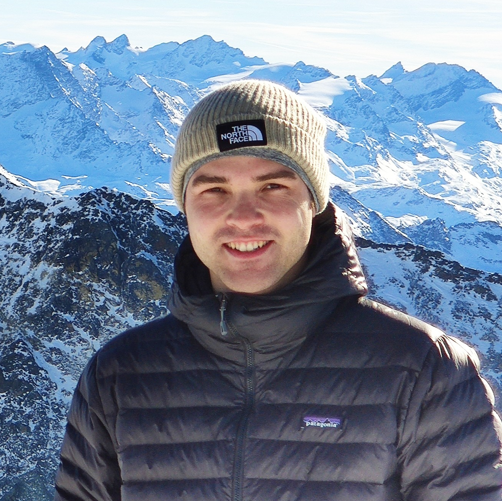

### Andreas Schlaginhaufen

PhD researcher @ EPFL 
<a href="https://www.linkedin.com/"> LinkedIn</a> 
 andreas.schlaginhaufen [at] epfl.ch

I am a PhD student at EPFL in the Systems Control and Multiagent Optimization Research lab, supervised by Professor Maryam Kamgarpour.
My research focuses on the theoretical side of inverse reinforcement learning and preference-based learning, with a broader interest in optimization, game theory, and applications to robotics.

### Robotics Projects
Selected robotics projects I supervised: [Robotics Projects](/robotics-projects/).

  <h3 style="margin: 0;">Publications</h3>
  (For an updated list check out my <a href="https://scholar.google.com/citations?user=rMBbj1YAAAAJ&hl=en&oi=ao">google scholar</a>)

[**Efficient Preference-Based Reinforcement Learning: Randomized Exploration Meets Experimental Design**](https://arxiv.org/abs/2506.09508) 
Andreas Schlaginhaufen, Reda Ouhamma, Maryam Kamgarpour, *Neural Information Processing Systems (NeurIPS), 2025.*

[**Eliciting Truthful Feedback for Preference-Based Learning via the VCG Mechanism**](https://arxiv.org/pdf/2510.17285) Leo Landolt, Anna Maddux, Andreas Schlaginhaufen, Saurabh Vaishampayan, Maryam Kamgarpour, *Preprint under review.*

[**Towards the Transferability of Rewards Recovered via Regularized Inverse Reinforcement Learning**](https://arxiv.org/abs/2406.01793) 
Andreas Schlaginhaufen, Maryam Kamgarpour, *Neural Information Processing Systems (NeurIPS), 2024.* 
(presented also at ICML 2024 Workshop: *Aligning Reinforcement Learning Experimentalists and Theorists*)

[**Convergence of a Model-Free Entropy-Regularized Inverse Reinforcement Learning Algorithm**](https://arxiv.org/abs/2403.16829) 
Titouan Renard, Andreas Schlaginhaufen, Tingting Ni, Maryam Kamgarpour, *Conference on Decision and Control (CDC), 2024.*

[**Identifiability and Generalizability in Constrained Inverse Reinforcement Learning**](https://arxiv.org/abs/2306.00629) 
Andreas Schlaginhaufen, Maryam Kamgarpour, *International Conference on Machine Learning (ICML), 2023.*

[**Learning Stable Deep Dynamics Models for Partially Observed or Delayed Dynamical Systems**](https://arxiv.org/abs/2110.14296)
Andreas Schlaginhaufen, Philippe Wenk, Andreas Krause, Florian Dörfler, *Neural Information Processing Systems (NeurIPS), 2021.*

