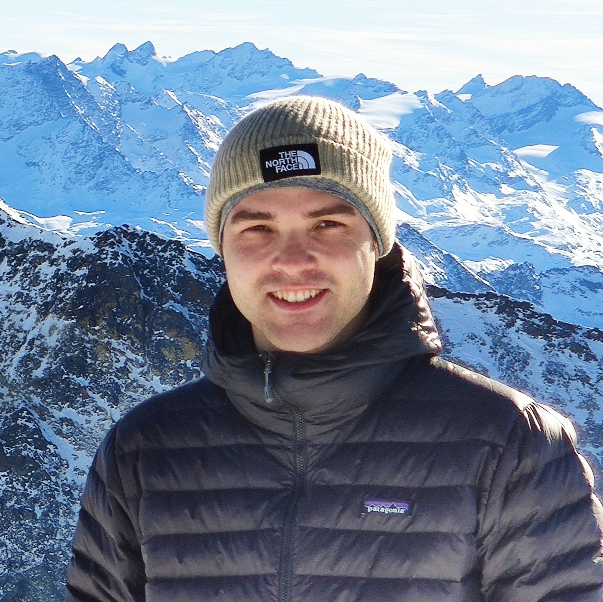

---

[//]: # ()

### Andreas Schlaginhaufen

PhD researcher @ EPFL

[//]: # (<a href="https://www.linkedin.com/"> LinkedIn</a>\)
[//]: # ( andreas.schlaginhaufen [at] epfl.ch)

# (I am a PhD student at EPFL in the Systems Control and Multiagent Optimization Research lab, supervised by Professor Maryam Kamgarpour. )
My research focuses on the theoretical side of inverse reinforcement learning and preference-based learning, with a broader interest in optimization, stochastic control, and game theory.

---
### Publications (an updated list can be found on [google scholar](https://scholar.google.com/citations?user=rMBbj1YAAAAJ&hl=en&oi=ao))
**Towards the Transferability of Rewards Recovered via Regularized Inverse Reinforcement Learning** 
Andreas Schlaginhaufen, Maryam Kamgarpour, *Neural Information Processing Systems (NeurIPS), 2024.* 
(presented also at ICML 2024 Workshop: *Aligning Reinforcement Learning Experimentalists and Theorists*)

**Convergence of a Model-Free Entropy-Regularized Inverse Reinforcement Learning Algorithm** 
Titouan Renard*, Andreas Schlaginhaufen*, Tingting Ni*, Maryam Kamgarpour, *Conference on Decision and Control (CDC), 2024.*

**Identifiability and Generalizability in Constrained Inverse Reinforcement Learning** 
Andreas Schlaginhaufen, Maryam Kamgarpour, *International Conference on Machine Learning (ICML), 2023.*
    
**Learning Stable Deep Dynamics Models for Partially Observed or Delayed Dynamical Systems** 
Andreas Schlaginhaufen, Philippe Wenk, Andreas Krause, Florian Dörfler, *Neural Information Processing Systems (NeurIPS), 2021.*

